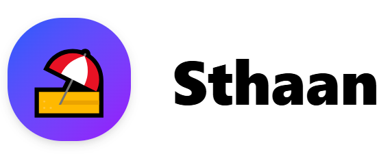
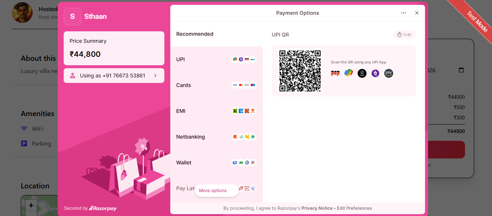
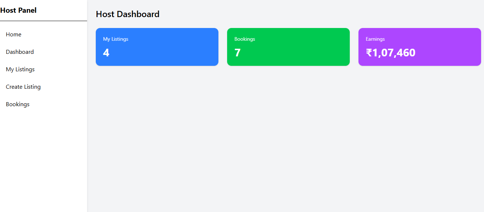
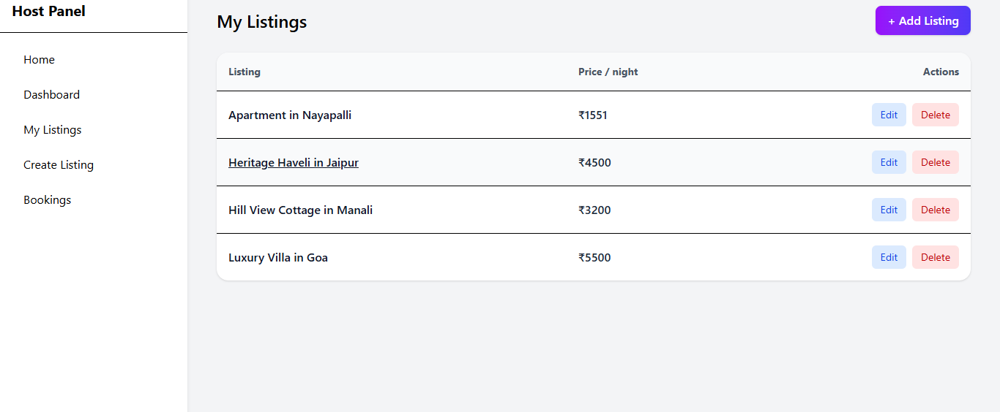
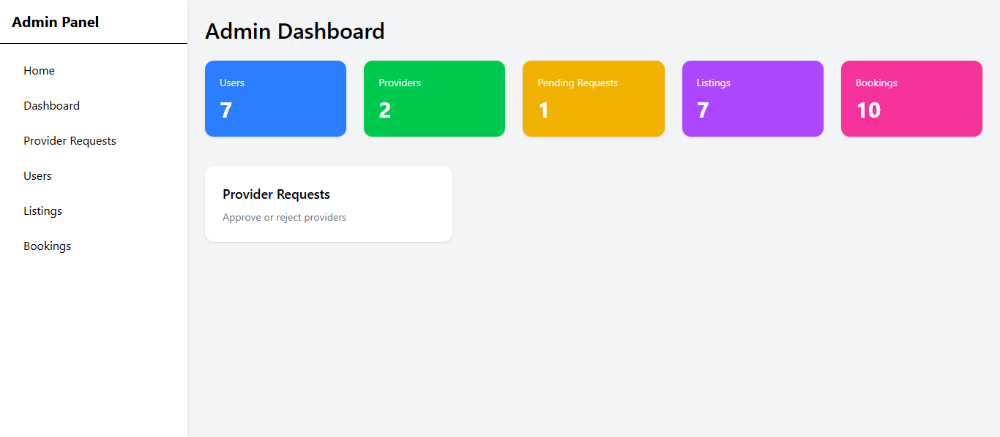

# 🏡 Sthaan – Airbnb Inspired Booking Platform (MERN)

  

  
  
  
  

---

## 🔴 Live Preview (Demo)
> 🔗 _Links_:  
> https://sthaan.vercel.app  
> https://sthaan.onrender.com  

---

## 📸 Screenshots

### 🏠 Home & Listings

  
  

### 📍 Listing Details

  
  

### 💳 Booking & Payment

  
  

### 🧑‍💼 Host Dashboard

  
  

### 🧑‍💼 Admin Dashboard

  
  
   
  

---

## ✨ About the Project

**Sthaan** is a full-stack Airbnb-inspired accommodation booking platform built with the **MERN stack**.

The goal of this project is to simulate **real-world booking, payment, and host management flows**, focusing on clean architecture and production-ready practices.

---

## 🚀 Core Features

### 👤 User
- Authentication (JWT + cookies)
- Browse listings
- Detailed listing page:
  - Image gallery
  - Amenities
  - Host info
  - Map (Leaflet)
- Secure booking with Razorpay
- My Bookings & Booking Details
- Payment success / failure handling

### 🏠 Host (Provider)
- Become a host
- Create / edit / delete listings
- Upload categorized images
- Host dashboard stats
- View bookings

### 🛠 Admin
- Admin dashboard
- Manage users
- Manage providers
- View bookings & listings

---

## 💳 Payments
- Razorpay (Test Mode)
- Secure order creation & verification
- Live mode ready (keys switch only)
- Webhook-ready architecture

---

## 🗺 Map Integration
- OpenStreetMap + Leaflet
- No API key required
- Free & production friendly
- Responsive map on listing details page

---

## 🧩 Tech Stack

**Frontend**
- React (Vite)
- Redux Toolkit
- React Router
- Tailwind CSS
- Leaflet

**Backend**
- Node.js
- Express.js
- MongoDB + Mongoose
- JWT Authentication
- Multer + Cloudinary
- Razorpay SDK

---

